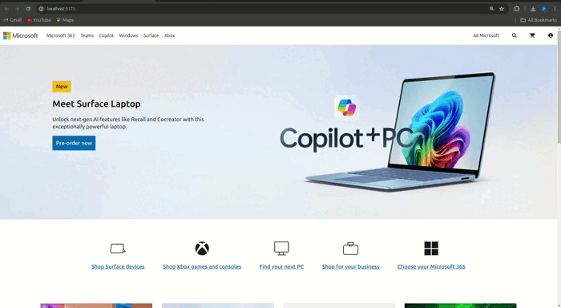

# Microsoft Home Page Clone

This project is a responsive clone of the Microsoft home page, created using HTML and Tailwind CSS. It replicates the design and layout of the Microsoft home page, providing a clean and responsive user interface.

## Features

- Responsive design that adjusts to different screen sizes
- Built with HTML and Tailwind CSS
- Includes typical homepage sections such as navigation, main banner, product showcases, and footer

## Demonstration 🖥️

#### Small Screens:

#### Large Screen:

